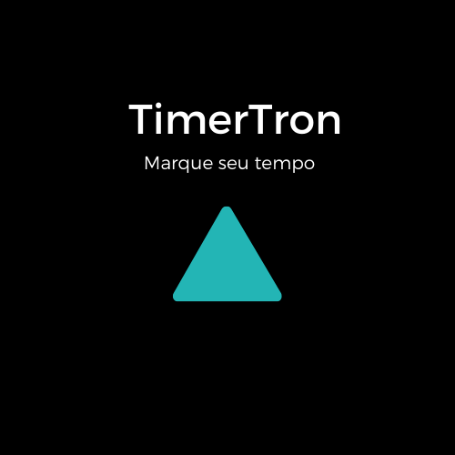

# TimerTron

<h1 align="center">
  
</h1>


## Aplicativo Desktop desenvolvido no curso de [Electron](https://www.electronjs.org/) da [Alura](https://www.alura.com.br/)

Finalidade: Marcar o tempo de estudo.

### Pré-requisitos

Antes de começar, você vai precisar ter instalado em sua máquina as seguintes ferramentas:
[Git](https://git-scm.com), [Node.js](https://nodejs.org/en/).
Além disto é bom ter um editor para trabalhar com o código como [VSCode](https://code.visualstudio.com/)

### Executando em modo de desenvolvimento

- Clonar repositorio

```bash
git clone https://github.com/geninhocell/timertron.git
```

- Entre na pasta do projeto

```bash
cd timertron
```

- Instalar dependencias.

```bash
yarn
```

- Executar.

```bash
yarn start
```

### Executar build e executar

- build para linux

```bash
yarn build:linux
```

- entrar na pasta dist/timertron-linux-x64

```bash
cd dist/timertron-linux-x64
```

- executar

```bash
./timertron
```

### Shortcuts

```bash
Ctrl+Shift+s (Play)|(Pause)
```

### 🛠 Tecnologias

As seguintes ferramentas foram usadas na construção do projeto:

- [Node.js](https://nodejs.org/en/)
- [Electron](https://www.electronjs.org/)

<!-- <h4 align="center">
	🚧  TimerTron 🚀 Em construção...  🚧
</h4> -->
